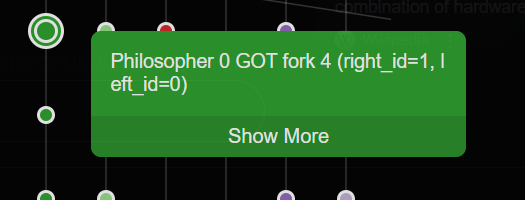

# P-Dining-Philosophers

A formal verification model of the classic Dining Philosophers problem implemented in the P programming language. This project demonstrates concurrent programming concepts and formal verification techniques using P's state machine modeling and model checking capabilities.

## Overview

The Dining Philosophers problem is a classic synchronization problem in computer science that illustrates the challenges of resource allocation and deadlock prevention in concurrent systems. This implementation uses P to model the behavior of philosophers and forks as state machines and verify correctness properties.

## Problem Description

- **5 Philosophers** sit around a circular table
- **5 Forks** are placed between adjacent philosophers
- Each philosopher alternates between **thinking** and **eating**
- To eat, a philosopher must acquire **both adjacent forks** (left first, then right)
- After eating, the philosopher releases both forks and returns to thinking

## Model Architecture

### State Machines

1. **Philosopher Machine (`Philo`)**: Models philosopher behavior

   - States: `Init`, `thinking`, `eating`
   - Events: `eAcquireFork`, `eForkAcquired`, `eReleaseFork`
   - **Strategy**: Always requests left fork first, then right fork

2. **Fork Machine (`Fork`)**: Models fork availability

   - States: `available`, `taken`
   - Events: `eAcquireFork`, `eReleaseFork`, `eForkAcquired`
   - **Current Issue**: Doesn't properly handle concurrent acquisition requests

3. **DeadlockDetection Spec**: Monitors system for potential deadlock
   - Observes: `eAcquireFork`, `eReleaseFork` events
   - **Detection**: Counts consecutive fork requests without releases
   - **Threshold**: Asserts failure if more than 9 requests without releases

### Key Features

- **Event-driven communication** between philosophers and forks
- **Sequential fork acquisition** (left-then-right strategy)
- **Deadlock detection** through request/release monitoring
- **Formal verification** using P model checker

## How It Works

1. **Initialization**:

   - Main machine creates 5 forks in a circular arrangement
   - Creates 5 philosophers, each assigned adjacent left and right forks
   - Philosopher i gets fork i (left) and fork (i+1)%5 (right)

2. **Philosopher Lifecycle**:

   - **Thinking**: Print status, request left fork
   - **Fork Acquisition**: Wait for `eForkAcquired`, then request right fork
   - **Eating**: When both forks acquired, print eating status
   - **Release**: Send `eReleaseFork` to both forks, return to thinking

3. **Fork Behavior**:
   - **Available**: Accept `eAcquireFork`, send `eForkAcquired`, go to taken
   - **Taken**: Handle `eReleaseFork` from holder, return to available
   - **Issue**: Currently ignores additional `eAcquireFork` requests when taken

## Compilation and Verification

### Prerequisites

- P Compiler and Runtime
- P Model Checker

### Build Commands

```bash
# Navigate to the PSrc directory
cd client_server_1

# Compile the P model
p compile

# Run model checking
p check -s 5 -t 100000
```

### Expected Results

#### ❌ Current State (Bug Detected Expected)

The model currently fails with:

```shell
Checker found a bug.
... Emitting traces:
..... Writing PCheckerOutput\BugFinding\ClientServer_0_0.txt
..... Writing PCheckerOutput\BugFinding\ClientServer_0_0.trace.json
..... Writing PCheckerOutput\BugFinding\ClientServer_0_0.schedule
... Elapsed 0.13 sec and used 0 GB.
... Emitting coverage report:
..... Writing PCheckerOutput\BugFinding\ClientServer.coverage.txt
..... Writing PCheckerOutput\BugFinding\ClientServer.sci
... Checking statistics:
..... Found 1 bug.
... Scheduling statistics:
..... Explored 1 schedule
..... Explored 1 timeline
..... Found 100.00% buggy schedules.
..... Number of scheduling points in terminating schedules: 49 (min), 49 (avg), 49 (max).
..... Writing PCheckerOutput\BugFinding\ClientServer_pchecker_summary.txt
... Elapsed 0.1948843 sec.
. Done
```

#### ✅ No Bugs Detected (When there's proper event handling)

When the code is fixed to handle events correctly, the model checker should pass without any bugs:

```shell
.. Test case :: DefaultImpl
... Checker is using 'random' strategy (seed:228306480).
..... Schedule #1
..... Schedule #2
..... Schedule #3
..... Schedule #4
..... Schedule #5
... Emitting coverage report:
..... Writing PCheckerOutput\BugFinding\ClientServer.coverage.txt
..... Writing PCheckerOutput\BugFinding\ClientServer.sci
... Checking statistics:
..... Found 0 bugs.
... Scheduling statistics:
..... Explored 5 schedules
..... Explored 2 timelines
..... Number of scheduling points in terminating schedules: 52 (min), 53 (avg), 58 (max).
..... Writing PCheckerOutput\BugFinding\ClientServer_pchecker_summary.txt
... Elapsed 0.2335911 sec.
. Done
```

## File Structure

```

client_server_1/
├── PSrc/
│ ├── Main.p # Main machine, creates philosophers and forks
│ ├── Philo.p # Philosopher state machine + event declarations
│ ├── Fork.p # Fork state machine
│ └── Test.p # Test configuration
├── PSpec/
│ └── Lock.p # DeadlockDetection specification
├── .gitignore # Ignore PGenerated, PCheckerOutput
└── README.md # This file

```

## Current Issues and Fixes

### 1. UnhandledEventException in Fork

**Problem**: Fork in `taken` state cannot handle additional `eAcquireFork` events
**Current Code**: Only prints a message (no event handler)
**Fix**: Add proper `defer` or rejection mechanism

### 2. Potential Deadlock

**Problem**: All philosophers could acquire left forks simultaneously
**Detection**: DeadlockDetection spec monitors request/release ratio
**Mitigation**: Currently relies on random timing, needs systematic prevention

### 3. Race Conditions

**Problem**: Multiple acquisition requests can cause state inconsistencies
**Impact**: Can lead to assertion failures and deadlock detection triggers

## Key Verification Properties

1. **Safety**: Only fork holder can release the fork (`assert philo_id == holder_id`)
2. **Progress**: System shouldn't have excessive requests without releases
3. **Event Handling**: All events should be properly handled in all states
4. **Resource Management**: Forks correctly track their holders

## Learning Outcomes

This project demonstrates:

- **Race condition detection** through formal verification
- **Event-driven state machine** modeling in P
- **Deadlock detection** using observational specifications
- **Common concurrency bugs** and their systematic detection
- **Model checking** as a verification technique

## Known Limitations

- **Simple deadlock detection**: Only counts requests vs releases
- **No starvation prevention**: Philosophers might wait indefinitely
- **Fixed acquisition order**: Always left-then-right (prone to deadlock)
- **No timeout mechanisms**: Relies on random scheduling for progress

---

_This project serves as an educational example of how formal verification can detect subtle concurrency bugs that might be missed in traditional testing._

```

```



Mismatch between Fork order and id
